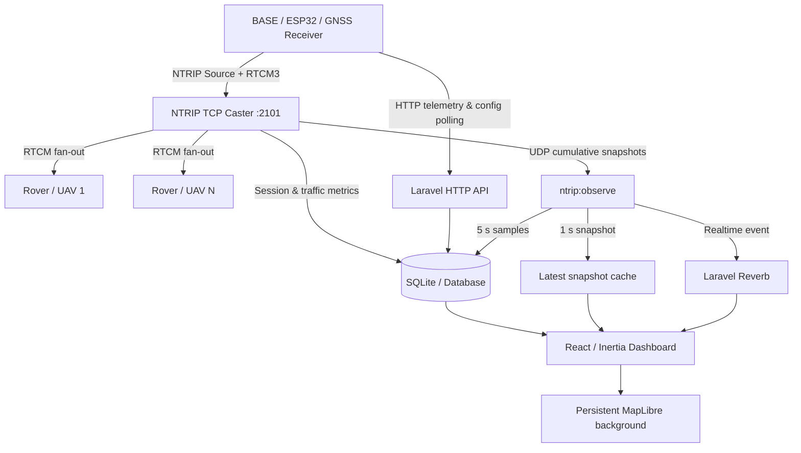

# NTRIP Caster Management & Observability Platform

Nền tảng quản lý NTRIP Caster phục vụ truyền dữ liệu hiệu chỉnh GNSS/RTK từ trạm **BASE** đến nhiều **Rover/UAV** theo thời gian thực. Hệ thống bao gồm TCP Caster, quản lý Station/Mountpoint/Rover Account, tự động phát hiện và provisioning thiết bị ESP32, telemetry, session tracking, cảnh báo, dashboard bản đồ và RTCM Flow Observability.

> Trạng thái hiện tại: **v0.1.0-beta** — đã hoàn thiện tính năng chính, cần field test và load test trước khi triển khai production diện rộng.

## Chức năng chính

- NTRIP TCP Caster nonblocking trên cổng mặc định `2101`.
- Nhận Source stream từ BASE và fan-out RTCM đến nhiều Rover.
- Parse RTCM3, đếm frame hợp lệ và lỗi CRC.
- Quản lý Station, cấu hình Station và Mountpoint.
- Tự động phát hiện ESP32 chưa được đăng ký và provisioning sau khi quản trị viên phê duyệt.
- Quản lý Rover Account, giới hạn kết nối và phân quyền theo Mountpoint.
- Lưu lịch sử Source/Rover session và thống kê lưu lượng.
- Alert Engine với vòng đời Open → Acknowledged → Resolved.
- Realtime Dashboard qua Laravel Reverb.
- MapLibre map-first UI; chuyển trang không làm mất trạng thái bản đồ.
- RTCM Flow Observability theo dõi `BASE → Caster → Rover`:
  - Snapshot realtime 1 giây.
  - Raw sample 5 giây, giữ mặc định 24 giờ.
  - Rollup 1 phút, giữ mặc định 30 ngày.
  - Biểu đồ throughput, fan-out, socket drain, latency, backlog và write events.
  - Chẩn đoán nghẽn tại BASE, Caster hoặc từng Rover.
- Responsive UI cho desktop, laptop, tablet và mobile.

## Kiến trúc tổng quát



## Công nghệ

| Thành phần | Công nghệ |
|---|---|
| Backend | PHP 8.3, Laravel 13, Sanctum, Fortify |
| Realtime | Laravel Reverb, Laravel Echo |
| Frontend | React 19, TypeScript 5.7, Inertia 3 |
| UI | Tailwind CSS 4, shadcn/ui, Radix UI, Lucide |
| Charts | Recharts 3 + shadcn Chart |
| Map | MapLibre GL |
| Database mặc định | SQLite |
| Queue/Scheduler | Laravel Queue, Laravel Scheduler |
| Test/Quality | Pest, PHPUnit, PHPStan/Larastan, Pint, ESLint, Prettier |

## Yêu cầu môi trường

- Ubuntu Linux.
- PHP `8.3` và các extension cần thiết: `bcmath`, `curl`, `intl`, `mbstring`, `pcntl`, `pdo_sqlite`, `xml`, `zip`.
- Composer.
- Node.js `>= 20`; khuyến nghị Node.js 22.
- npm.
- SQLite 3.
- Git, curl, unzip, netcat.
- Nginx và Supervisor cho production.

## Cài đặt nhanh

### 1. Chuẩn bị môi trường một lần

```bash
cd ~/NTRIP/NTRIP_SERVER/ntrip_caster
chmod +x ntrip_project.sh
./ntrip_project.sh setup-env
./ntrip_project.sh check
```

### 2. Cài dự án sau khi clone hoặc copy

```bash
cd ~/NTRIP/NTRIP_SERVER/ntrip_caster
./ntrip_project.sh setup-project
```

Lệnh trên thực hiện:

```text
composer install
npm install
create database/database.sqlite if missing
create .env from .env.example if missing
generate APP_KEY when needed
php artisan optimize:clear
php artisan migrate
npm run build
```

### 3. Cấu hình `.env`

Cấu hình tối thiểu cho local development:

```env
APP_NAME="NTRIP Caster"
APP_ENV=local
APP_DEBUG=true
APP_URL=http://127.0.0.1:8000

DB_CONNECTION=sqlite
QUEUE_CONNECTION=database
CACHE_STORE=file

BROADCAST_CONNECTION=reverb

REVERB_APP_ID=ntrip-local
REVERB_APP_KEY=ntrip-local-key
REVERB_APP_SECRET=ntrip-local-secret
REVERB_HOST=127.0.0.1
REVERB_PORT=8080
REVERB_SCHEME=http

VITE_REVERB_APP_KEY="${REVERB_APP_KEY}"
VITE_REVERB_HOST="${REVERB_HOST}"
VITE_REVERB_PORT="${REVERB_PORT}"
VITE_REVERB_SCHEME="${REVERB_SCHEME}"

NTRIP_HOST=0.0.0.0
NTRIP_PORT=2101
NTRIP_PUBLIC_HOST=127.0.0.1
NTRIP_MANAGEMENT_PORT=8000
NTRIP_PROVISIONING_KEY=replace-with-a-long-random-secret

NTRIP_OBSERVABILITY_ENABLED=true
NTRIP_OBSERVABILITY_DRIVER=udp
NTRIP_OBSERVABILITY_SNAPSHOT_MS=1000
NTRIP_OBSERVABILITY_HOST=127.0.0.1
NTRIP_OBSERVABILITY_PORT=22101
NTRIP_OBSERVABILITY_BIND_HOST=127.0.0.1
NTRIP_OBSERVABILITY_LATEST_CACHE_STORE=file
NTRIP_OBSERVABILITY_LATEST_TTL_SECONDS=10
```

Không commit `.env`, Source Token, Rover password hoặc provisioning key vào Git.

## Chạy local development

Cách khuyến nghị:

```bash
cd ~/NTRIP/NTRIP_SERVER/ntrip_caster
composer dev
```

Script `composer dev` hiện nên chạy đồng thời:

```text
Laravel HTTP server       :8000
Queue worker              default, alerts
Laravel scheduler
Laravel Pail logs
Vite development server   :5173
NTRIP Caster              :2101
Observability collector   UDP :22101
Laravel Reverb            :8080
```

Không chạy thêm `reverb:start`, `ntrip:serve` hoặc `ntrip:observe` ở terminal khác khi `composer dev` đã chạy các process này, tránh lỗi trùng cổng.

### Chạy từng process để debug

```bash
php artisan serve --host=0.0.0.0 --port=8000
npm run dev -- --host=0.0.0.0 --port=5173
php artisan queue:listen --queue=default,alerts --tries=2 --timeout=30
php artisan schedule:work
php artisan reverb:start --host=0.0.0.0 --port=8080 --debug
php artisan ntrip:serve
php artisan ntrip:observe
```

## Kiểm tra nhanh

```bash
curl http://127.0.0.1:8000/up
curl http://127.0.0.1:8000/api/health
curl http://127.0.0.1:8000/api/v1/system/status

printf "GET / HTTP/1.1\r\nHost: localhost\r\n\r\n" \
    | nc 127.0.0.1 2101

ss -lntp | grep -E '8000|8080|2101|22101'
```

Các API quản trị nằm trong `auth:sanctum` và `verified`; gọi bằng `curl` không có phiên đăng nhập sẽ nhận `401`.

## Kiểm tra chất lượng và test

```bash
composer test:backend
composer types:check
composer lint:check

npm run format:check
npm run lint:check
npm run types:check
npm run build
```

Chạy toàn bộ pipeline:

```bash
composer ci:check
```

## Graceful shutdown

Khi đang chạy `composer dev` hoặc `php artisan ntrip:serve`, nhấn `Ctrl+C`. Caster phải đóng Source/Rover sockets, hoàn tất session và cập nhật trạng thái Source.

Dòng `exited with code SIGINT` là bình thường khi người dùng chủ động dừng process. Một syscall đang chờ UDP có thể bị SIGINT ngắt; không được coi là lỗi vận hành nếu chỉ xuất hiện trong lúc shutdown.

## Production

Không dùng `composer dev` trong production. Chạy Nginx + PHP-FPM cho HTTP và quản lý các process lâu dài bằng Supervisor hoặc systemd:

```text
queue worker
scheduler hoặc cron artisan schedule:run
reverb:start
ntrip:serve
ntrip:observe
```

Triển khai build:

```bash
./ntrip_project.sh deploy
```

Mở firewall tối thiểu:

```bash
sudo ufw allow 80/tcp
sudo ufw allow 443/tcp
sudo ufw allow 2101/tcp
```

Giữ `8080` và `22101` nội bộ nếu Reverb được proxy bởi Nginx và Collector chạy cùng máy.

## Cấu trúc chính

```text
app/
├── Console/Commands/          Artisan commands
├── Events/                    Realtime domain events
├── Http/Controllers/Api/      HTTP API
├── Jobs/                      Queue jobs
├── Models/                    Eloquent models
└── Services/
    ├── Alerts/                Alert Engine
    ├── Dashboard/             Dashboard snapshot
    ├── Devices/               Pending device & provisioning
    ├── Ntrip/                 TCP Caster, auth, parser, sessions
    └── Observability/         RTCM Flow metrics pipeline

resources/js/
├── components/                Shared UI and map components
├── contexts/                  Persistent map dashboard state
├── features/                  Feature modules
├── pages/                     Inertia pages
├── realtime/                  Echo contracts, reducers, resync
└── pages/system/              RTCM Flow Observability UI

database/migrations/           Database schema
routes/api.php                 HTTP API routes
routes/channels.php            Broadcast authorization
routes/console.php             Scheduler definitions
routes/web.php                 Inertia web routes
docs/                          Detailed specifications and operations docs
```

## Tài liệu chi tiết

Bắt đầu tại [`docs/README.md`](docs/README.md).

- [Kiến trúc hệ thống](docs/architecture/system-architecture.md)
- [Cấu hình môi trường](docs/setup/configuration.md)
- [NTRIP Caster](docs/features/ntrip-caster.md)
- [Device discovery & provisioning](docs/features/device-provisioning.md)
- [Station và telemetry](docs/features/stations.md)
- [Mountpoint](docs/features/mountpoints.md)
- [Rover Account & access control](docs/features/rover-access.md)
- [NTRIP Sessions](docs/features/sessions.md)
- [Alert Engine](docs/features/alerts.md)
- [Realtime Dashboard](docs/features/dashboard-realtime.md)
- [RTCM Flow Observability](docs/features/system-observability.md)
- [HTTP API](docs/api/http-api.md)
- [Realtime events](docs/api/realtime-events.md)
- [Database](docs/data/database-schema.md)
- [Testing](docs/operations/testing.md)
- [Deployment](docs/operations/deployment.md)
- [Runbook vận hành](docs/operations/runbook.md)
- [Troubleshooting](docs/operations/troubleshooting.md)
