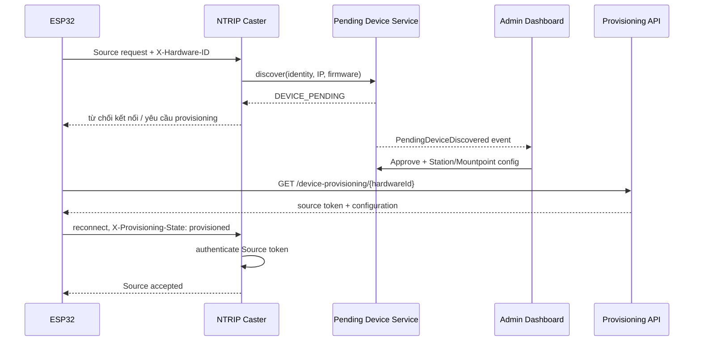
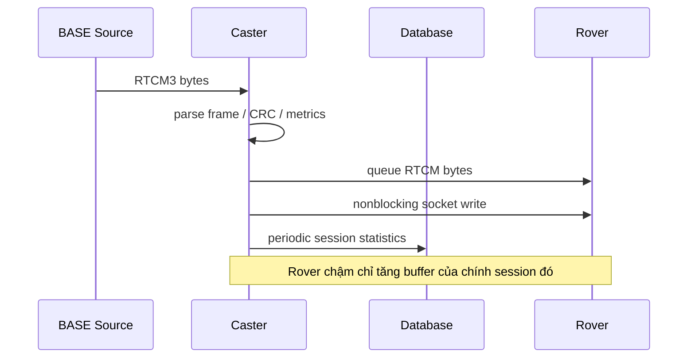
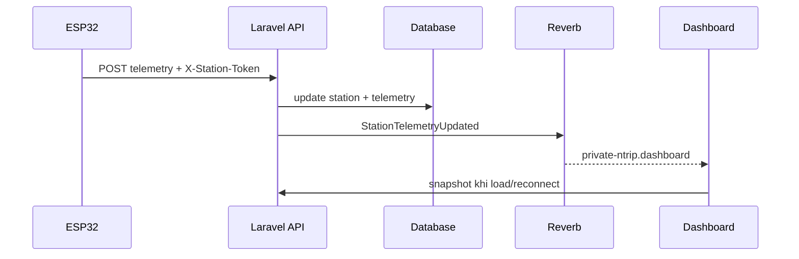
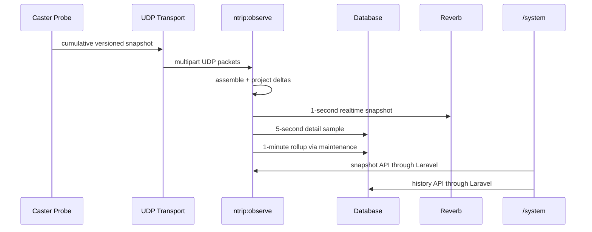

# Luồng dữ liệu end-to-end

## 1. Provisioning thiết bị mới

```mermaid
sequenceDiagram
    participant E as ESP32
    participant C as NTRIP Caster
    participant P as Pending Device Service
    participant A as Admin Dashboard
    participant API as Provisioning API

    E->>C: Source request + X-Hardware-ID
    C->>P: discover(identity, IP, firmware)
    P-->>C: DEVICE_PENDING
    C-->>E: từ chối kết nối / yêu cầu provisioning
    P-->>A: PendingDeviceDiscovered event
    A->>P: Approve + Station/Mountpoint config
    E->>API: GET /device-provisioning/{hardwareId}
    API-->>E: source token + configuration
    E->>C: reconnect, X-Provisioning-State: provisioned
    C->>C: authenticate Source token
    C-->>E: Source accepted
```

## 2. Source RTCM và Rover fan-out

```mermaid
sequenceDiagram
    participant B as BASE Source
    participant C as Caster
    participant DB as Database
    participant R as Rover

    B->>C: RTCM3 bytes
    C->>C: parse frame / CRC / metrics
    C->>R: queue RTCM bytes
    C->>R: nonblocking socket write
    C->>DB: periodic session statistics
    Note over C,R: Rover chậm chỉ tăng buffer của chính session đó
```

## 3. Telemetry và dashboard

```mermaid
sequenceDiagram
    participant E as ESP32
    participant API as Laravel API
    participant DB as Database
    participant W as Reverb
    participant UI as Dashboard

    E->>API: POST telemetry + X-Station-Token
    API->>DB: update station + telemetry
    API->>W: StationTelemetryUpdated
    W-->>UI: private-ntrip.dashboard
    UI->>API: snapshot khi load/reconnect
```

## 4. Observability

```mermaid
sequenceDiagram
    participant C as Caster Probe
    participant U as UDP Transport
    participant O as ntrip:observe
    participant DB as Database
    participant W as Reverb
    participant UI as /system

    C->>U: cumulative versioned snapshot
    U->>O: multipart UDP packets
    O->>O: assemble + project deltas
    O->>W: 1-second realtime snapshot
    O->>DB: 5-second detail sample
    O->>DB: 1-minute rollup via maintenance
    UI->>O: snapshot API through Laravel
    UI->>DB: history API through Laravel
```
