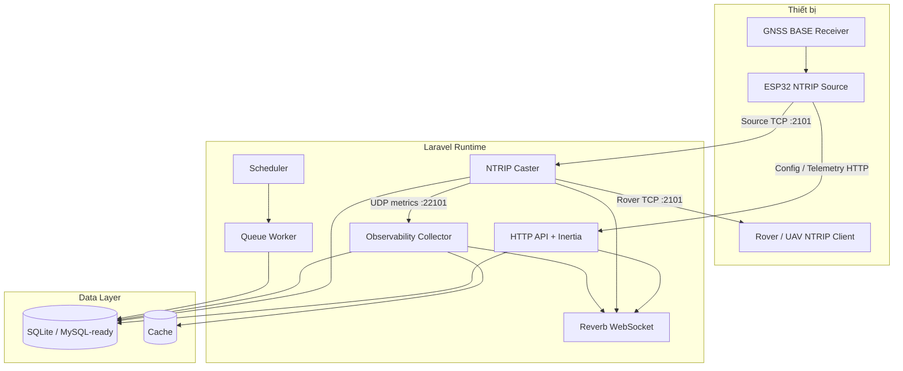

# Kiến trúc hệ thống

## 1. Mục tiêu kiến trúc

Hệ thống phải nhận RTCM từ nhiều trạm BASE, phân phối đến nhiều Rover/UAV, quản lý danh tính và quyền truy cập, đồng thời cung cấp khả năng quan sát toàn bộ pipeline theo thời gian thực.

## 2. Các lớp chính

## 3. Runtime processes

| Process | Vai trò | Có trạng thái lâu dài |
|---|---|---:|
| PHP-FPM / Artisan serve | HTTP API, Inertia | Không |
| `ntrip:serve` | TCP Caster nonblocking | Có, trong memory và DB session |
| `ntrip:observe` | Nhận UDP metrics, snapshot, persistence | Có, trong memory |
| `reverb:start` | WebSocket server | Có |
| Queue worker | Alert jobs và background work | Có |
| Scheduler | Kích hoạt jobs/maintenance | Có |
| Vite | Chỉ development | Có |

## 4. Nguyên tắc thiết kế

- Caster không block bởi HTTP API hoặc persistence chậm.
- Socket Source/Rover dùng nonblocking I/O và output buffer giới hạn.
- Observability tách khỏi Caster bằng contract và UDP transport.
- Realtime event không thay thế database; client phải có snapshot/resync API.
- MapLibre tồn tại trong layout dùng chung để không reset khi chuyển trang.
- API payload backend dùng snake_case; frontend normalizer chuyển sang camelCase.
- Secret chỉ lưu dạng hash hoặc encrypted; không trả lại từ API sau khi tạo/provision.

## 5. Ranh giới lỗi

- HTTP lỗi không được làm Caster dừng.
- Reverb lỗi không được làm Observer dừng nhận UDP.
- Observer lỗi không được làm Caster dừng fan-out.
- Một Rover chậm không được block các Rover khác.
- Một event realtime bị mất được bù bằng snapshot API sau reconnect.
