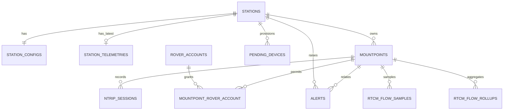

# Database Schema

## Database mặc định

SQLite tại:

```text
database/database.sqlite
```

Production SQLite cần quyền ghi cả file và thư mục `database/` để tạo journal/WAL.

## Quan hệ chính



## Bảng domain

### `stations`

Identity, enable flag, Source token hash, connection/last-seen metadata.

### `station_configs`

Revisioned configuration: caster, Mountpoint-related device settings, UART, telemetry/config intervals, max RTCM age.

### `mountpoints`

NTRIP stream catalog and access mode.

### `station_telemetries`

Latest JSON telemetry payload per Station.

### `ntrip_sessions`

Source/Rover connection lifecycle, bytes, RTCM stats, identity and disconnect reason.

### `rover_accounts`

Rover credentials, enable/expiry and connection limit.

### `mountpoint_rover_account`

Per-Mountpoint grant with schedule and connection limit.

### `pending_devices`

Discovered hardware identity, reported config/state, approval/rejection/provision timestamps and encrypted one-time provisioning secret.

### `alerts`

Alert lifecycle, severity, fingerprint, references and acknowledgement/resolution metadata.

### `alert_rule_states`

Debounce/recovery state used by evaluator.

### `rtcm_flow_samples`

5-second detailed metrics. Includes `rolled_up_at` to protect unprocessed rows.

### `rtcm_flow_rollups`

1-minute aggregates; unique by Mountpoint and bucket start.

## Migration policy

- Không sửa migration đã chạy ở môi trường dùng chung; tạo migration mới.
- Migration phải hỗ trợ SQLite và database production mục tiêu.
- Thêm index cho filter theo status/time/Mountpoint.
- Thay đổi retention/schema observability cần cập nhật HistoryService và frontend normalizer.

## Backup SQLite

Khi ứng dụng đang chạy, dùng SQLite backup command thay vì copy file tùy ý:

```bash
sqlite3 database/database.sqlite ".backup '/path/backup.sqlite'"
```
