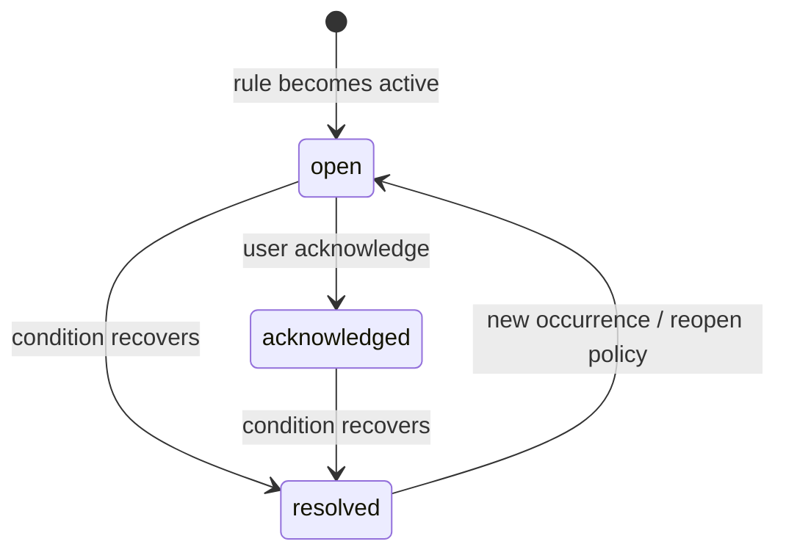

# Đặc tả: Alert Engine

## Mục tiêu

Phát hiện lỗi vận hành có ý nghĩa, debounce để tránh nhiễu, quản lý vòng đời cảnh báo và phát realtime tới bell drawer.

## Loại cảnh báo hiện có

- `STATION_OFFLINE`.
- `SOURCE_DISCONNECTED`.
- `RTCM_STREAM_STALLED`.
- `RTCM_CRC_ERRORS`.

## Severity

```text
warning
critical
```

## Vòng đời



## Đánh giá rule

- Scheduler chạy job `EvaluateAlerts` định kỳ, hiện thiết kế có thể chạy mỗi 5 giây.
- Rule state lưu debounce/recovery state.
- Alert không được tạo trùng liên tục cho cùng fingerprint đang active.
- Auto-resolve sau recovery delay.

## API

- `GET /api/v1/alerts` với filter status, severity, station, search, pagination.
- `GET /api/v1/alerts/summary`.
- `POST /api/v1/alerts/{alert}/acknowledge`.

## Realtime events

- `AlertOpened`.
- `AlertUpdated`.
- `AlertAcknowledged`.
- `AlertResolved`.

## UI

Không cần trang Alerts riêng trong bản beta; bell drawer hiển thị active/history và cho acknowledge.

## Tiêu chí nghiệm thu

- Điều kiện chập chờn không tạo alert storm.
- Một alert active có fingerprint duy nhất.
- Acknowledge lưu user và timestamp.
- Condition hồi phục tự resolve.
- Summary khớp danh sách active.
