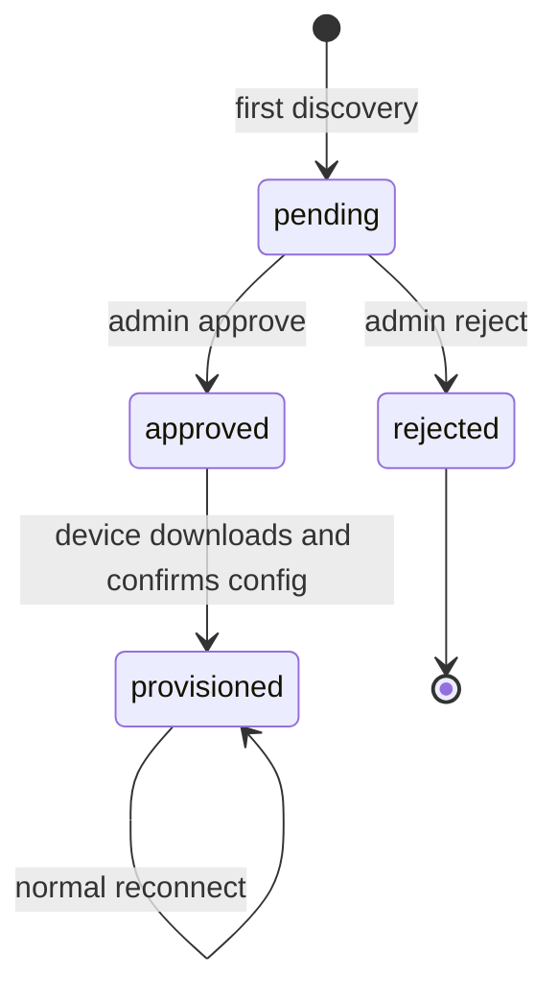

# Đặc tả: Device Discovery & Provisioning

## Mục tiêu

Cho phép ESP32 mới kết nối tới Caster mà chưa có Station, xuất hiện trong danh sách Pending Devices, được quản trị viên approve/reject và tải cấu hình an toàn.

## Header nhận dạng Source

```text
X-Hardware-ID          bắt buộc cho discovery, tối đa 64, chuẩn hóa uppercase
X-Device-ID            tùy chọn, tối đa 64
X-Mountpoint           tùy chọn, tối đa 64
X-Firmware-Version     tùy chọn, tối đa 64
X-Provisioning-State   bootstrap | provisioned
```

Source không có `X-Hardware-ID` được xử lý theo legacy flow.

## State machine



## Luồng approve

1. Quản trị viên chọn Pending Device ở trạng thái `pending`.
2. Nhập Station name, `device_id`, Mountpoint và cấu hình.
3. Service tạo Station, StationConfig, Mountpoint và Source Token.
4. Source Token được lưu encrypted trong PendingDevice để giao một lần qua provisioning API; Station chỉ lưu hash.
5. Pending Device chuyển `approved`.
6. Thiết bị gọi provisioning API và lưu cấu hình.
7. Thiết bị reconnect với `X-Provisioning-State: provisioned` và token.

## Provisioning API

```http
GET /api/v1/device-provisioning/{hardwareId}
X-Provisioning-Key: <secret>
```

Có thể dùng `Authorization: Bearer <secret>`.

Response state:

- Chưa thấy hardware ID: `pending`.
- Pending: `pending`.
- Rejected: `rejected`.
- Approved/provisioned: trả `status` và `data` cấu hình.
- Provisioning key sai/rỗng: `403`.

## Realtime

- `PendingDeviceDiscovered` khi lần đầu thấy thiết bị.
- `PendingDeviceUpdated` khi dữ liệu hoặc state thay đổi.
- Phát trên private channel dashboard.

## Tiêu chí nghiệm thu

- Header chứa CR/LF hoặc vượt giới hạn bị từ chối.
- Chỉ Pending Device trạng thái `pending` được approve/reject; state sai trả `409`.
- Provisioning API không hoạt động nếu `NTRIP_PROVISIONING_KEY` rỗng.
- Device rejected không thể chuyển tiếp sang Source authentication.
- Token không xuất hiện trong list/show pending devices.
